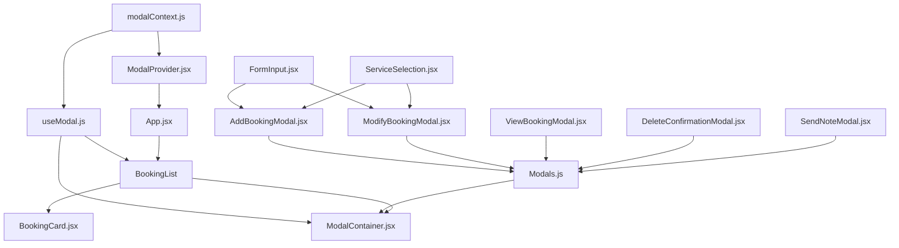

# Booking Management Modal System - Complete Flow Documentation

## Overview

This documentation describes the complete architecture and data flow of a modular React-based popup modal system for managing bookings. The system uses React Context for state management and provides a seamless user experience for creating, viewing, modifying, and deleting bookings.

---

## Architecture Overview

### Core Philosophy

The modal system follows a **centralized context pattern** where:

- A single context provider manages all modal state
- Components trigger modals via a custom hook
- A container component handles modal rendering logic
- Individual modal components handle their specific UI and interactions

---

## File Structure and Dependencies

```
src/components/popup/
├── modalContext.js          # Context definition (foundation)
├── ModalProvider.jsx        # Context provider (wraps app)
├── useModal.js              # Custom hook (access context)
├── ModalContainer.jsx       # Modal router (renders correct modal)
├── BookingCard.jsx          # Booking display (triggers modals)
├── FormInput.jsx            # Reusable form field
├── ServiceSelection.jsx     # Service picker component
├── AddBookingModal.jsx      # Create new booking
├── ModifyBookingModal.jsx   # Edit existing booking
├── ViewBookingModal.jsx     # Display booking details
├── DeleteConfirmationModal.jsx  # Confirm deletion
├── SendNoteModal.jsx        # Send message to client
└── Modals.js               # Re-export file (optional)
```

---

## Complete Data Flow

### Level 1: Foundation Layer

#### **1. modalContext.js**

**Purpose:** Defines the React Context that will store modal state globally.

**Code:**

```javascript
import { createContext } from "react";

export const ModalContext = createContext();
```

**What it does:**

- Creates a context object that can be accessed anywhere in the component tree
- No dependencies
- Must be created first before any other modal files

**Exports:** `ModalContext`

---

#### **2. ModalProvider.jsx**

**Purpose:** Provides modal state and control functions to the entire app.

**Imports:**

- `React.useState` (state management)
- `ModalContext` from `./modalContext`

**State:**

```javascript
{
  isOpen: false,        // Is any modal currently open?
  type: null,           // Which modal? ('add', 'modify', 'view', 'delete', 'sendNote')
  data: null            // Booking data to pass to modal
}
```

**Functions:**

- `openModal(type, data)` - Opens a specific modal with optional data
- `closeModal()` - Closes any open modal and clears state

**What it does:**

1. Wraps your app (or part of it) in `<ModalProvider>`
2. Manages modal state centrally
3. Provides context value to all children
4. Any descendant can access modal functions via `useModal` hook

**Usage in App.jsx:**

```javascript
import ModalProvider from "./components/popup/ModalProvider";

export default function App() {
  return (
    <ModalProvider>
      <BookingList />
    </ModalProvider>
  );
}
```

**Exports:** `ModalProvider` component

---

#### **3. useModal.js**

**Purpose:** Custom hook to access modal context from any component.

**Imports:**

- `React.useContext`
- `ModalContext` from `./modalContext`

**What it does:**

- Provides a convenient way to access modal functions
- Throws error if used outside `ModalProvider`
- Returns `{ modalState, openModal, closeModal }`

**Usage:**

```javascript
import { useModal } from "./components/popup/useModal";

function SomeComponent() {
  const { openModal } = useModal();
  
  return (
    <button onClick={() => openModal('add')}>
      Add Booking
    </button>
  );
}
```

**Exports:** `useModal` hook

---

### Level 2: Utility Components

#### **4. FormInput.jsx**

**Purpose:** Reusable form input field with consistent styling.

**Props:**

- `label` - Field label text
- `value` - Input value
- `onChange` - Change handler
- `type` - Input type (default: "text")
- `required` - Is field required?

**Used by:**

- `AddBookingModal.jsx`
- `ModifyBookingModal.jsx`

**Exports:** `FormInput` component

---

#### **5. ServiceSelection.jsx**

**Purpose:** Grid-based service selector with visual feedback.

**Props:**

- `selected` - Currently selected service
- `onSelect` - Selection handler function

**Services available:**

- Haircut, Coloring, Styling, Treatment, Consultation

**Used by:**

- `AddBookingModal.jsx`
- `ModifyBookingModal.jsx`

**Exports:** `ServiceSelection` component

---

### Level 3: Display Components

#### **6. BookingCard.jsx**

**Purpose:** Displays a single booking with action buttons.

**Props:**

- `booking` - Booking object with all details
- `onView` - Handler to view details
- `onEdit` - Handler to modify booking
- `onDelete` - Handler to delete booking
- `onSendNote` - Handler to send note

**What it displays:**

- Client name and service
- Date and time
- Status badge (confirmed/pending)
- Action buttons (View, Edit, Delete, Send Note)

**Flow:**

1. Receives booking data from parent (`BookingList`)
2. User clicks an action button
3. Calls corresponding handler (e.g., `onEdit(booking)`)
4. Handler calls `openModal('modify', booking)`
5. `ModalContainer` detects state change and renders `ModifyBookingModal`

**Exports:** `BookingCard` component

---

### Level 4: Modal Components

#### **7. AddBookingModal.jsx**

**Purpose:** Form to create a new booking.

**Imports:**

- `FormInput` from `./FormInput`
- `ServiceSelection` from `./ServiceSelection`
- Icons from `lucide-react`

**Props:**

- `onClose` - Function to close modal
- `onSave` - Function to save new booking

**Form fields:**

- Client Name, Phone Number
- Date, Time
- Service (via ServiceSelection)
- Notes (optional)

**Flow:**

1. User fills form
2. Clicks "Add Booking"
3. `onSave` called with form data
4. Parent updates bookings state
5. Modal closes

**Exports:** `AddBookingModal` component

---

#### **8. ModifyBookingModal.jsx**

**Purpose:** Form to edit an existing booking.

**Imports:**

- `FormInput` from `./FormInput`
- `ServiceSelection` from `./ServiceSelection`

**Props:**

- `booking` - Current booking data
- `onClose` - Close handler
- `onUpdate` - Update handler

**Pre-fills form with existing booking data**

**Flow:**

1. Form pre-populated with `booking` data
2. User modifies fields
3. Clicks "Update Booking"
4. `onUpdate` called with modified data
5. Parent updates bookings state
6. Modal closes

**Exports:** `ModifyBookingModal` component

---

#### **9. ViewBookingModal.jsx**

**Purpose:** Read-only view of booking details.

**Props:**

- `booking` - Booking to display
- `onClose` - Close handler
- `onEdit` - Optional edit handler

**Displays:**

- Client name
- Date and time
- Service
- Phone number
- Notes
- Status

**Has "Edit" button that can trigger ModifyBookingModal**

**Exports:** `ViewBookingModal` component

---

#### **10. DeleteConfirmationModal.jsx**

**Purpose:** Confirmation dialog before deleting a booking.

**Props:**

- `booking` - Booking to delete
- `onClose` - Cancel handler
- `onConfirm` - Delete confirmation handler

**Flow:**

1. Shows booking details
2. User clicks "Delete" to confirm or "Cancel" to abort
3. If confirmed, `onConfirm(booking.id)` called
4. Parent removes booking from state
5. Modal closes

**Exports:** `DeleteConfirmationModal` component

---

#### **11. SendNoteModal.jsx**

**Purpose:** Send a message/note to a client.

**Props:**

- `booking` - Target booking/client
- `onClose` - Close handler
- `onSend` - Send handler

**Flow:**

1. Shows client name
2. User types message in textarea
3. Clicks "Send"
4. `onSend(booking.id, noteText)` called
5. Parent handles note sending logic
6. Modal closes

**Exports:** `SendNoteModal` component

---

### Level 5: Orchestration Layer

#### **12. ModalContainer.jsx**

**Purpose:** Decides which modal to render based on context state.

**Imports:**

- `useModal` from `./useModal`
- All modal components:
  - `AddBookingModal`
  - `ModifyBookingModal`
  - `ViewBookingModal`
  - `DeleteConfirmationModal`
  - `SendNoteModal`

**Props:**

- `bookings` - Current bookings array
- `setBookings` - State setter to update bookings

**Logic:**

```javascript
const { modalState, closeModal } = useModal();

if (!modalState.isOpen) return null;

switch (modalState.type) {
  case 'add':
    return <AddBookingModal onClose={closeModal} onSave={handleSave} />;
  case 'modify':
    return <ModifyBookingModal booking={modalState.data} onClose={closeModal} onUpdate={handleUpdate} />;
  case 'view':
    return <ViewBookingModal booking={modalState.data} onClose={closeModal} />;
  case 'delete':
    return <DeleteConfirmationModal booking={modalState.data} onClose={closeModal} onConfirm={handleDelete} />;
  case 'sendNote':
    return <SendNoteModal booking={modalState.data} onClose={closeModal} onSend={handleSendNote} />;
  default:
    return null;
}
```

**Handles:**

- Adding new bookings to state
- Updating existing bookings
- Deleting bookings
- Sending notes (console log for now)

**Exports:** `ModalContainer` component

---

#### **13. Modals.js (Optional)**

**Purpose:** Barrel export file for cleaner imports.

**Contents:**

```javascript
export { default as AddBookingModal } from "./AddBookingModal";
export { default as ModifyBookingModal } from "./ModifyBookingModal";
export { default as ViewBookingModal } from "./ViewBookingModal";
export { default as DeleteConfirmationModal } from "./DeleteConfirmationModal";
export { default as SendNoteModal } from "./SendNoteModal";
```

**Allows:**

```javascript
// Instead of multiple imports:
import AddBookingModal from "./AddBookingModal";
import ModifyBookingModal from "./ModifyBookingModal";
// etc...

// You can do:
import { AddBookingModal, ModifyBookingModal } from "./Modals";
```

---

## Complete Application Flow

### Initialization Flow

```
1. App.jsx renders
   └─> Wraps BookingList in <ModalProvider>

2. ModalProvider initializes
   └─> Creates modal state: { isOpen: false, type: null, data: null }
   └─> Provides context to children

3. BookingList renders
   ├─> Maps bookings array to BookingCard components
   └─> Renders ModalContainer at bottom
```

---

### User Interaction Flow: Adding a Booking

```
1. User clicks "Add New Booking" button in BookingList
   └─> Calls: openModal('add')

2. ModalProvider updates state
   └─> { isOpen: true, type: 'add', data: null }

3. ModalContainer detects state change
   └─> Renders AddBookingModal

4. User fills form and clicks "Add Booking"
   └─> AddBookingModal calls onSave(formData)
   └─> ModalContainer's handleSave runs
       ├─> Creates new booking with unique ID
       ├─> Updates bookings state: setBookings([...bookings, newBooking])
       └─> Calls closeModal()

5. Modal closes, new booking appears in list
```

---

### User Interaction Flow: Editing a Booking

```
1. User clicks "Edit" button on BookingCard
   └─> onEdit(booking) called
   └─> openModal('modify', booking)

2. ModalProvider updates state
   └─> { isOpen: true, type: 'modify', data: booking }

3. ModalContainer detects state change
   └─> Renders ModifyBookingModal with booking data

4. Form pre-fills with existing data
   └─> User changes fields
   └─> Clicks "Update Booking"
   └─> ModifyBookingModal calls onUpdate(modifiedData)

5. ModalContainer's handleUpdate runs
   ├─> Finds booking in array by ID
   ├─> Replaces old booking with updated one
   ├─> Updates state: setBookings(updatedArray)
   └─> Calls closeModal()

6. Modal closes, updated booking shows in list
```

---

### User Interaction Flow: Deleting a Booking

```
1. User clicks "Delete" on BookingCard
   └─> openModal('delete', booking)

2. DeleteConfirmationModal appears
   └─> Shows booking details
   └─> User clicks "Delete" to confirm

3. onConfirm(booking.id) called
   └─> ModalContainer's handleDelete runs
       ├─> Filters out booking by ID
       ├─> Updates state: setBookings(filtered)
       └─> Calls closeModal()

4. Modal closes, booking removed from list
```

---

## Import Order and Dependencies

### Correct Build Order

1. **modalContext.js** (no dependencies)
2. **ModalProvider.jsx** (depends on: modalContext)
3. **useModal.js** (depends on: modalContext)
4. **FormInput.jsx** (no local dependencies)
5. **ServiceSelection.jsx** (no local dependencies)
6. **BookingCard.jsx** (no local dependencies)
7. **AddBookingModal.jsx** (depends on: FormInput, ServiceSelection)
8. **ModifyBookingModal.jsx** (depends on: FormInput, ServiceSelection)
9. **ViewBookingModal.jsx** (no local dependencies)
10. **DeleteConfirmationModal.jsx** (no local dependencies)
11. **SendNoteModal.jsx** (no local dependencies)
12. **Modals.js** (depends on: all modal components) [optional]
13. **ModalContainer.jsx** (depends on: useModal, all modals)

---

## Visual Dependency Graph



---

## Key Design Patterns

### 1. Context Pattern

- Centralized state management
- Avoids prop drilling
- Single source of truth

### 2. Container/Presenter Pattern

- `ModalContainer` = smart component (logic)
- Modal components = presentational (UI)

### 3. Compound Component Pattern

- `ModalProvider` + `useModal` work together
- Clean API for consumers

### 4. Controlled Components

- All forms use controlled inputs
- React manages form state

---

## Benefits of This Architecture

1. **Scalability:** Easy to add new modal types
2. **Maintainability:** Clear separation of concerns
3. **Reusability:** Utility components shared across modals
4. **Testability:** Each component has single responsibility
5. **Type Safety:** PropTypes validation on all components
6. **Developer Experience:** Simple API (`openModal`, `closeModal`)

---

## Usage Example in App

```javascript
import { useState } from "react";
import ModalProvider from "./components/popup/ModalProvider";
import { useModal } from "./components/popup/useModal";
import BookingCard from "./components/popup/BookingCard";
import ModalContainer from "./components/popup/ModalContainer";

const initialBookings = [
  { 
    id: 1, 
    date: "2025-01-15", 
    time: "9:00 am", 
    service: "Shower Service", 
    client: "Jack Josh", 
    phone: "123-456-7890", 
    status: "confirmed", 
    notes: "" 
  }
];

function BookingList() {
  const { openModal } = useModal();
  const [bookings, setBookings] = useState(initialBookings);
  
  return (
    <div className="min-h-screen bg-[#f3f3fa] flex flex-col items-center pt-7">
      <button onClick={() => openModal("add")}>
        Add New Booking
      </button>
      
      {bookings.map((booking) => (
        <BookingCard
          key={booking.id}
          booking={booking}
          onView={(b) => openModal("view", b)}
          onEdit={(b) => openModal("modify", b)}
          onDelete={(b) => openModal("delete", b)}
          onSendNote={(b) => openModal("sendNote", b)}
        />
      ))}
      
      <ModalContainer bookings={bookings} setBookings={setBookings} />
    </div>
  );
}

export default function App() {
  return (
    <ModalProvider>
      <BookingList />
    </ModalProvider>
  );
}
```

---

## Troubleshooting Common Issues

### Issue: "Failed to resolve import './modalContext'"

**Solution:** Create `modalContext.js` file:

```javascript
import { createContext } from "react";
export const ModalContext = createContext();
```

### Issue: "Failed to resolve import './Modals'"

**Solution:** Either create `Modals.js` barrel export OR import modals individually in `ModalContainer.jsx`

### Issue: "useModal must be used within ModalProvider"

**Solution:** Ensure your component tree is wrapped in `<ModalProvider>`

### Issue: Modals not appearing

**Solution:** Check that `ModalContainer` is rendered in your component tree and `isOpen` state is true

---

## Adding a New Modal Type

1. **Create modal component** (e.g., `ConfirmBookingModal.jsx`)
2. **Export in Modals.js**
3. **Import in ModalContainer.jsx**
4. **Add case to switch statement**
5. **Call `openModal('confirm', data)` from any component**

Example:

```javascript
// In ModalContainer.jsx
case 'confirm':
  return <ConfirmBookingModal booking={modalState.data} onClose={closeModal} onConfirm={handleConfirm} />;
```

---

This architecture provides a robust, maintainable foundation for managing booking interactions through an elegant modal system!
